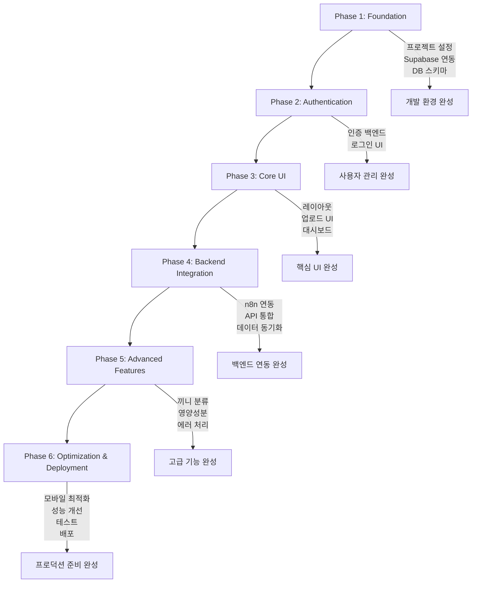

# AI 식단 관리 서비스 MVP 개발 Task 개요

## 📋 전체 Phase 구조

### Phase 1: 프로젝트 기반 설정 (Foundation)
- [ ] [Phase1_Foundation.md](./phases/Phase1_Foundation.md) - 프로젝트 초기 설정, Supabase 연동, DB 스키마

### Phase 2: 인증 시스템 (Authentication)  
- [ ] [Phase2_Authentication.md](./phases/Phase2_Authentication.md) - Supabase Auth 설정 및 인증 UI

### Phase 3: 핵심 UI 구현 (Core UI)
- [ ] [Phase3_Core_UI.md](./phases/Phase3_Core_UI.md) - 레이아웃, 사진 업로드, 대시보드 UI

### Phase 4: 백엔드 연동 (Backend Integration)
- [ ] [Phase4_Backend_Integration.md](./phases/Phase4_Backend_Integration.md) - n8n 웹훅, API 통합, 데이터 동기화

### Phase 5: 고급 기능 (Advanced Features)
- [ ] [Phase5_Advanced_Features.md](./phases/Phase5_Advanced_Features.md) - 끼니 분류, 영양성분, 로딩/에러 처리

### Phase 6: 최적화 및 배포 (Optimization & Deployment)
- [ ] [Phase6_Optimization_Deployment.md](./phases/Phase6_Optimization_Deployment.md) - 모바일 최적화, 성능, 테스트, 배포

## 🔄 의존성 관계

## ⏱️ 예상 개발 기간

- **Phase 1**: 1-2일 (프로젝트 기반 설정)
- **Phase 2**: 1-2일 (인증 시스템)
- **Phase 3**: 2-3일 (핵심 UI)
- **Phase 4**: 2-3일 (백엔드 연동)
- **Phase 5**: 2-3일 (고급 기능)
- **Phase 6**: 2-3일 (최적화 및 배포)

**총 예상 기간**: 10-16일

## 🎯 MVP 핵심 기능 우선순위

### 필수 (Must Have)
- Phase 1: 프로젝트 기반 설정
- Phase 2: 사용자 인증 시스템
- Phase 3: 핵심 UI (사진 업로드, 기본 대시보드)
- Phase 4: n8n 웹훅 연동 및 백엔드 통합

### 중요 (Should Have)
- Phase 5: 고급 기능 (끼니 분류, 로딩 상태 처리)
- Phase 6: 모바일 최적화

### 선택 (Could Have)
- Phase 5: 고급 영양성분 표시
- Phase 6: 성능 최적화, 포괄적 테스트

## 📝 진행 상황 추적

### ✅ 완료된 작업
- [x] **PRD 분석 및 Task 분리** - 제품 요구사항 분석 완료
- [x] **문서 구조 설계** - 6개 Phase로 체계적 분리 완료
- [x] **Phase별 상세 문서 작성** - 각 Phase별 구현 가이드 완료
- [x] **의존성 관계 정의** - Phase 간 순서 및 의존성 명확화
- [x] **개발 가이드 완성** - 체크리스트 기반 진행 추적 시스템 구축

### 🚀 개발 준비 완료!
각 Phase 내에서 세부 체크리스트로 진행 상황을 추적합니다. 
**전체 개발 진행률: 0/6 Phases 완료 (0%)**
**문서화 및 계획: 100% 완료 ✅**

## 🚀 시작하기

### 개발 순서 권장사항

1. **Phase 1 (기반 설정)** - 필수 선행 작업
   - 프로젝트 초기 설정 → Supabase 연동 → DB 스키마 순서로 진행
   - 모든 기반 설정 완료 후 다음 단계 진행

2. **Phase 2 (인증)** - 사용자 관리
   - 인증 백엔드 로직 → 인증 UI 순서로 진행
   - 사용자 관리 시스템 완료 후 핵심 기능 개발 시작

3. **Phase 3 (핵심 UI)** - 사용자 인터페이스
   - 레이아웃 → 업로드 인터페이스 → 대시보드 순서
   - UI 완성 후 백엔드 연동 시작

4. **Phase 4 (백엔드 연동)** - 핵심 로직
   - n8n 웹훅 → API 통합 → 데이터 동기화 순서
   - 백엔드 연동 완료 후 고급 기능 개발

5. **Phase 5 (고급 기능)** - 사용자 경험 향상
   - 끼니 분류 → 영양성분 → 로딩/에러 처리 순서
   - 모든 기능 완성 후 최적화 및 배포 준비

6. **Phase 6 (최적화 & 배포)** - 프로덕션 준비
   - 모바일 최적화 → 성능 개선 → 테스트 → 배포 순서

### 개발 팁

- 각 Phase 시작 전 이전 Phase 완료 확인
- Mock 데이터로 UI 먼저 구현 후 실제 API 연동
- 모바일 우선으로 개발하되 데스크톱 호환성 확보
- Phase별 테스트로 안정성 확보
- 각 Phase 내 체크리스트를 순서대로 진행

---
*마지막 업데이트: 2025-09-24*
